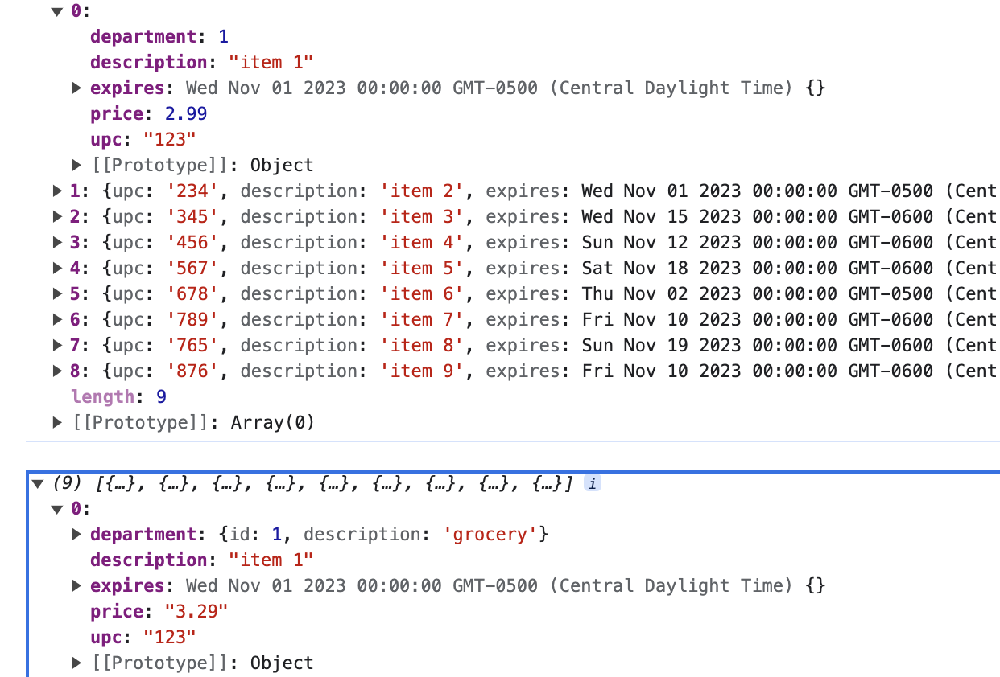
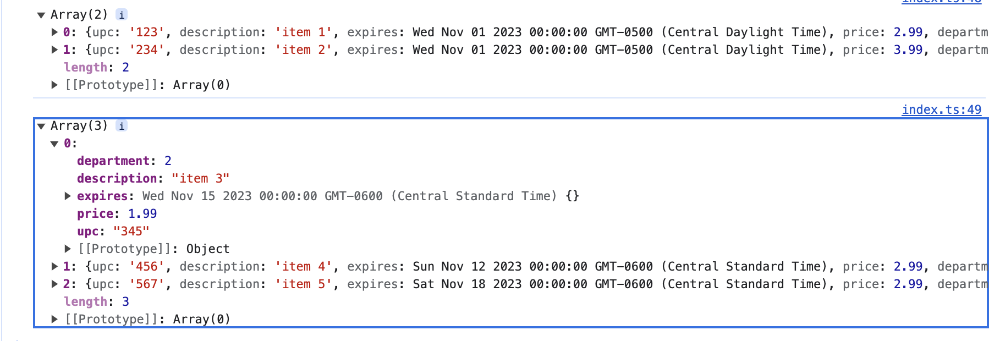

# monads mix-up

List of Monads available:

- Box
- Maybe
- Either
- Option
- Result
- Try

also supplied

- compose
- curry

## compose

usage:

```js
import { compose } from './utils';
import { products, depts } from './data';
import type { Product, Department } from './data';

console.log('products', products);

const addDiscount = (items: Product[]) =>
  items.map((item) => ({ ...item, price: item.price * 1.1 }));
const twoDecimals = (items: Product[]) =>
  items.map((item) => ({ ...item, price: item.price.toFixed(2) }));
const addDeptInfo = (items: Product[]) =>
  items.map((item) => ({
    ...item,
    department: depts.filter((d) => d.id === item.department)[0]
  }));

const discountedProducts = compose(addDiscount, twoDecimals, addDeptInfo);

console.log('***** compose)
console.log(discountedProducts(products));
```



tradionally the compose function reads from right to left, but I really don't like that implementation so this version of cmpose reads from left to right. First we add the discount, then fix the decimals, and then replace the department information with a little more details.

## curry

usage

```js
import { curry } from './utils';

const findProducts = (dept: number) => {
    return (price: number) => {
        return products.filter(p => p.department === dept && p.price < price)
    }
}

const curriedFindProducts = curry(findProducts);

console.log(***** curry)
console.log(curriedFindProducts(2)(3))

const findByDepartment = (d: number) => curriedFindProducts(d);

const findByGrocery = findByDepartment(1)
const findByMeat = findByDepartment(2)
const findGroceryByAmount = (a: number) => findByGrocery(a)
const findMeatByAmount = (a: number) => findByMeat(a)
console.log(findGroceryByAmount(5))
console.log(findMeatByAmount(3))
```


